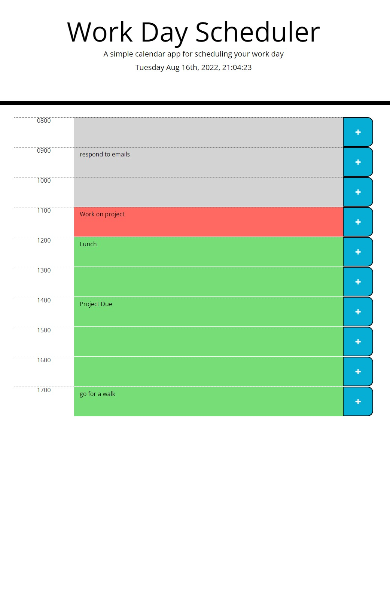

# 05_Third_Party_APIs

* Daily Planner

* Link To Deployed Site

https://laurencvengros.github.io/Daily_Planner/

# Description

* This is a simple daily planner app that will run in your browser.
* It uses dynamic HTML and CSS and is powered by Jquery.

# Functionality

* WHEN I open the page
  THEN The current day, adte and time is displayed in read time and updated by the second.

* WHEN I view the hourly timeblocks
  THEN I am presented with color coded blocks that tell me what hours are past, which are upcoming, and what hour it is currently.

* IF I click into a time block
  THEN I can  write my own text reminders inside.

* IF I want to save my text
  THEN I can click the plus sign and my text will save In local storage and still display when the browser is refreshed.

# Screenshot of the Application

